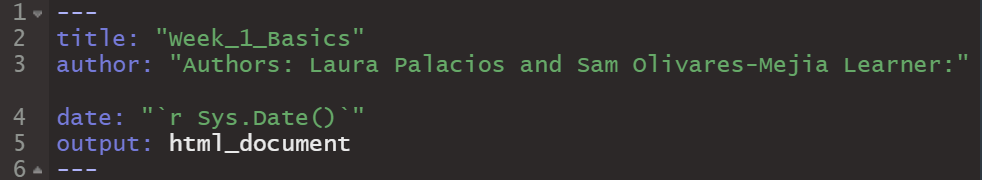

```{r setup, include=FALSE}
library(knitr) #load 'knitr package
opts_chunk$set(echo = TRUE)
```

# R101 - Week 1

#### Hello! Welcome to Laura and Sam's R101 teaching sessions! Today we're going to go over some of the R basics.

## Navigating R studio
You have most likely opened this file using RStudio, which is an interface that makes R more user-friendly. There are four main windows or 'panes' in RStudio. 

**Source**: This is the panel where you will write/view your code. Some outputs like data sets may also appear as a tab here. 

**Console/Terminal**: The console will display the execution of the code in your source. You can write code in this section as well, however it is best practice to write your code in the Source panel (in a Script or Rmd file) in order to save your progress. The terminal allows you to access your system shell. We will only be using the console today.

**Environment/History**: The environment will show what data sets and objects/variables you have created, as well as some properties of those objects such as their type and dimensions. The history tab contains a history of all the commands you've executed in R. 

**Files/Plots/Packages/Help/Viewer**: This panel will show you the contents of the directories on your computer. The tabs will help you navigate and set the working directory, show any plots generated, show what packages are actively loaded, and display help files for R functions and packages. 

```{r graphic1, echo=FALSE, fig.align="center", out.height="65%", out.width="65%"}
include_graphics("rstudio_session_4pane_layout.PNG")
```

## Projects vs Single Scripts and R Markdowns
A project is a collection of work organized in a folder. It allows you to keep all the files associated with a project together in one place, which makes it easier to import, export, and edit your files. To open or create a new project, navigate to 'File'>'Open Project' or 'New Project'. 

Your project will typically include a mix of scripts and R markdown (Rmd) files. A script is a text file containing a set of commands and comments, it is the simplest version of a file that you can use in R. An Rmd file is a more stylized version of a script with formatted plain text and chunks of code that create a sophisticated output such as a PDF or HTML. You can work on scripts or Rmds independently instead of through a project, however if is best practice to create scripts/Rmd files within projects. 

*Note: You may have already noticed that we've been highlighting 'best practices'. This is because there are many ways to achieve the same goal in R, which makes it very easy to lose track of what you're doing and how you're doing it. In general best practices revolve around organization, documentation, and version control (saving your progress).* 

## Rmd format
Let's dive into some of the aspects of an Rmd file. There are certain formatting elements to keep in mind when writing code in an Rmd. As mentioned before, and Rmd can include plain text (narratives) like what you're reading right now.

```{r}
# It can also contain chunks of code like this. 
```

Text within a code chunk needs a # in front of the line in order to be read as a comment instead of code to be executed. A code chunk usually starts with ```` ```{ }```` and ends with ```` ``` ```` on the last line. There are certain settings you can use to change what is shown in the Rmd output from the code chunk. For example, you can chose to only show the result of your code in the output and hide the code that executed that command. that's how I was able to insert the image in the previous section, without you seeing the code that did that.  

In addition to code chunks, you can also have 'inline' R code which is embedded in the narratives of the documents using the syntax `` `r ` ``. 

In the plain text, the formatting is slightly different. Instead of indicating the beginning of a comment, the # in the narrative creates a header. The number of # indicates how big the header is.
<br/><br/>

#### Here is an example header using four #s 
Do you notice how small the header is compared to the others in this document which mainly use two #s?
<br/><br/>
We also just used `<br/><br/>` to add extra breaks between paragraphs. Like #s, the number of `<br/>` you use indicates the size, or number of  breaks between paragraphs. <p> We could also use `<p>` to start a new paragraph instead of starting a new line manually. 
<br/><br/>


### Text Formatting 
  - Text surrounded by ** on both ends ie. `**text**` creates **bold text**. 
  - Text surrounded by only one * on both ends ie. `*text*` creates *italicized text*. 
  - Additionally, a url surrounded by `< >` creates a hyperlink. You can even change the display text of the link by using the following format: `[text to display](link url)` There are other formatting nuances and further detail on the other elements we covered that can be found on this [Rmarkdown cheat sheet](https://www.rstudio.com/blog/the-r-markdown-cheat-sheet/)
  - To create bullet points, we used two spaces followed by a `-`

*Note: If you're reading this within RStudio, this section may be a bit confusing, because we've had to add additional syntax to display the examples properly in the output file. To get a clearer idea of these formatting details, read this document in its HTML format.* 
<br/><br/>

### Setting Parameters

In addition to text format, there are a couple other elements of an Rmarkdown to highlight. At the beginning of the document, you may have noticed a title, author and date. These were set using output options which are defined at the beginning of the Rmd file along with the output file type. You can also set the theme of the markdown as well as other parameters, but we won't go into detail on those today. 

```{r graphic2, echo=FALSE, fig.align="center"}
 
```

Let's take a closer look at `Sys.Date()` in the date parameter. This is an example of a function that executes a particular command. What does it do though? In order to look up help files for specific functions, go to the console in RStudio and enter `?Sys.Date()`. A help file will pop up in the 'Help' tab in the bottom right, which provides information on the function. Of note is the description, details, and examples. 

**TO DO**: Go ahead and scroll to the top of the Rmd file in R studio and enter your name as the 'Learner'.

## Installing packages loading libraries

Now that we've learned about the basic format of our files, we have one more step before we can start executing commands. As we mentioned earlier, there are many ways to achieve the same goal in R. It is also an open source software, meaning that it is free for anyone to use and build upon. Because of this, there are extensions to the programming language in the form of packages. Kind of like an expansion pack with new characters in a board game, packages are full of new functions that perform different tasks. 

### Necessary Functions

A function in R is a statement that takes a parameter(argument) and executes a command(performs a particular task). Some functions are included as part of the R programming language (known as Base R), while others have to be installed and loaded into our "library". You can even create your own functions! 

So how do we add packages to our library? There are two base functions we use to do this: `install.packages()` and `library()`. Notice how there is nothing inside the parentheses. Unlike `Sys.Date()`, we need to input an argument inside the function for it to work, in this case the name of the package we want to load in. 

There are several significant differences between the `install.packages()` and `library()` functions. The most important is that you only ever have to install a package once when using the same computer, but you will have to load the package into your library every time you open a new session in R. 

### Running the Code
Let's check if you have 'knitr' installed already. Run the code chunk below by clicking the green 'play' button on the upper right hand corner of the code chunk in Rstudio. 

```{r}
library(knitr) #load 'knitr package
```

If you got an error message, that means that you do not have 'knitr' installed already. Copy and paste `install.packages("knitr")` into the code chunk (above `library(knitr)`  and run it again to install the package. 

*Note: The order functions are written in matters! If you put `install.packages("knitr")` after`library(knitr)`, you will get an error message. This is because code runs top to bottom, and the knitr package would not have existed yet. The same goes for when you load packages into your library. You may have noticed that we already have `library(knitr)` at the beginning of the document. This is because the functions we used to insert the images into the Rmd earlier are from the knitr package.*

When you are done installing knitr, make sure to delete the line of code you copy and pasted into the code chunk. Since we will eventually turn this document into an HTML file, the `install.packages()`function needs to be removed in order to properly render the file. Now that you've installed 'knitr' you will never have to run `install.packages("knitr")` again!

### Checking our Work 
Now that we've loaded our packages and entered our name at the top of our document, let's see how our output has changed. To render the document into an HTML, click the 'Knit' button at the top of the source pane. 
```{r graphic3, echo=FALSE, fig.align='center'}
include_graphics("knit.PNG")
```

After a moment the HTML document should replace the help file in the bottom right, this time in the Viewer tab. You should now see your name at the top of the document! 

## R Variables

### What is an R variable?
A variable is a way to store a piece of information. It can later be used to reference or manipulate.


### How does it work?
The information is first named, then assigned a value. The value assignment can either be done directly by the user or programmatically assigned.

**TO DO** Below, write the most commonly used way of assigning a value in R.

How to assign a value:

*Hint: Python uses an =.*

*Hint: Example seen below.*


### Variable names
There are some rules to follow when assigning names. These include:

  - Easy to understand
  - No spaces or special characters
  - Starts with a letter
  - Letter is is followed by any letter, number, underscore, or period
  - No reserved words (reserved words are used in arguements and may cause computer confusion if used as a variable name)  Here is a list: https://rdrr.io/r/base/Reserved.html
  
**TO DO** Write a possible name for a variable which contains bird data

Bird data variable name:

*Hint: One example could be frequent_flyers*


### Variable practice
To start, we'll assign some simple variables for the different types of data that R uses.
<br/><br/>


#### 1. Numeric data
Variables can be assigned any number.

Here is an example:
```{r}
# R can hold whole numbers
Whole_Number <- 1
# R can hold multiple decimal places
Decimal <- 7.5895892
```
Run this code chunk (click the green arrow in the top right of the chunk).

Notice the environment (top right) now contains your variables and their assigned values.

  
**TO DO** Assign the variables in the code block below
```{r}
# Assign a negative number 
Negative_Number <- 9999
  
# Assign any other number
Any_Number <- 9999
```
*Tip: Notice that when a variable is properly assigned it changes color*


**TO DO** Assign a new number to the Decimal variable
```{r}
# Assign a new number
Decimal <-9999
```
Notice that the value has changed in your environment. 


**TO DO** What value would appear if we ran the first code (Decimal <- 7.5895892) again?

Answer:

*Hint: The value is always overwritten by the last code block, regardless of order in script.*
<br/><br/>


#### 2. Integers
Integers are a numeric value with no decimal points.

A suffix of L indicates that the value is an integer.Example below.
```{r}
# Assign an integer - example
Integer <- 1L
```


**TO Do** Assign your own integer
```{r}
# Assign an integer
My_Integer <- 9999
```
*Tip: Integers have a numeric color when properly assigned*
<br/><br/>


#### 3. Character data
Character data  can include words, sentences, filepaths, etc. It is stored and treated as a block of text.

Example:
```{r}
# Notice that single quotes are used to indicate the string component
Magical_Phrase <- 'Hello World'
```
Notice that the character data also occurs in your environment.

**TO DO** Lets try assigning some:
```{r}
# Assign a descriptive word
Adjective <- '9999'

# Assign your favorite animal
Animal <- '9999'

# Assign a celebrity name
Celebrity <- '9999'

# Assign anything!
Thing <- '9999'

# Assign a different thing
# Notice the 2 indicates that this is a different variable and the original Thing is not overwritten.
Thing2 <- '9999'
```

**TO DO** Can I use double quotes?
```{r}
#Assign a happy phrase in double quotation marks (")
Exclamation <- "9999"
```
*Hint: Yes! Single or double quotes may be used.*

**TO DO** Can I use more than one word?
```{r}
# Write the favorite activity you did last week
# Example: Activity <- "swam in the pool" 
#or
#Example: Activity <- "Ran on a trail"
Activity <- "9999"
```
*Hint: The quotation marks should be placed around the entire phrase*
<br/><br/>


#### 4. Complex
Complex data handles imaginary numbers in R

Imaginary numbers are indicated with an i.

**To Do** Replace this imaginary animal with an imaginary number such as 2i.
```{r}
# Attribute Imaginary with a complex number. 
Imaginary <- 'Unicorn'
```
*Hint: Complex values do not require quotation marks, proper formatting will change the color to the numeric color*
<br/><br/>


#### 5. Logical/ Boolean
Logical data is True or False.

Example:
```{r}
# Assign as a TRUE logical value.
Logic_True <- TRUE
```
Notice that the TRUE value is all caps and the color is the same as the complex and numeric variables.

**To Do** Create a false variable
```{r}
# Assign a false logical value
Logic_False <- 9999
```
*Tip: Autofill can be used. After typing "FAL" a dropdown will appear. Press down arrow and enter OR click to select*
<br/><br/>


#### 6. Raw
Converts other data types to raw bytes. This is not a common type.

Example:
chartoRaw() and intToBits() are used to convert a value to a raw variable type.
```{r}
# Character to raw example
Raw_Character <- charToRaw("Hello World")
# Integer to bits example
Raw_Int <- intToBits(7L)
```


## R Data Structures

### What are data structures?
Data structures are storage components for holding multiple values.
<br/><br/>


#### 1. Vectors 
A vector is a collection of data values, such as characters, logical, integer, or numeric. It can be treated like a single column on a table.

Example. Here is a character vector. Use the notation c() (concatenate) to create the collection of values.
```{r}
# Create a character vector
Character_Vector <- c('Snoopy', 'Charlie Brown', 'Linus')
```
*Tip: Notice the environment show characters [1:3] (count of data) then lists the values*


**To do** Create an Atomic Vector, a vector that consists of one value, containing your favorite location. 
```{r}
# Assign a place
Place <- '9999'
```
*Hint: We made atomic vectors in the Variables section*


**To do** Create a numeric vector
```{r}
# Create a numeric vector
Number_Vector <- 9999
```
*Hint: separate values with commas and use the c() notation*


Vectors can use a combination of data types.
**To do**
Create a vector with 3 components of different data types.
```{r}
# Create a mixed vector
Mixed_Vector <- 9999
```
*Hint: Try a mix character, integer, numeric, or logical values*


Data structures, including vectors, can also reference previously created variables by using their names.
```{r}
# Create a mixed vector of different data types
My_Vector <- c(9999, 9999, 9999)
```
*Tip: Notice that this becomes a chr (character) list (shown in the environment). R will automatically determine an appropriate format unless otherwise specified by you*
<br/><br/>


#### 2. Lists
A list is a collection of data values, such as characters, logical, integer, or numeric. 
So why is this different than a vector?

Lists are ordered, recursive (loopable) and multidimensional!
(They are more complex so you can do more things!)


Here is an example of a simple list
```{r}
# Create a short list
List_Example<- list('test', 1, 2, 3)
```
Notice that the list appears in the data section of the environment.


Is it possible to create a list of other items?

**TO DO:** Create a list of your vector (My_Vector), List Example(List_Example), and one other atomic vector you previously created.
```{r}
# Create a list of lists
List_Of_Lists <- 9999
```
*Hint: Use the function list() to create a list*
<br/><br/>


#### 3. DataFrames
A data frame is a two dimensional way to store data, similar to a sheet in Microsoft Excel or Google sheets. We can also think of it as two or more vectors.

Example: Here is a simple dataframe created in R.
```{r}
# Create a vector for the first column
Song <- c("Rings", "Birds", "Hens", "Doves", "Partridge in a Pear Tree")
# Create a vector for the second column (same length)
Count <- c(5,4,3,2,1)

#Create the dataframe
Example_Dataframe <- data.frame(Song,Count)
```
*Tip: click on the data frame from the environment to open a new tab and view the sheet*
*Tip: press the down arrow in the environment to see a summary of data frame contents*


Please note. For most of SWNC work, we will be importing data frames (such as CSV files) rather than creating our own. This will be covered in another session.
<br/><br/>


#### 4. Matrices
A matrix is a set of rows and columns which organizes values of the same data type.

Mathmatical functions can be applied to matrices for complex analyses.
Here is an example matrix created in R:
```{r}
# The matrix creation requires the values (1-9), number of rows and/or number of columns)
Matrix_example <- matrix(c(1:9), nrow = 3, ncol = 3)
```
*Tip: Click on the matrix example in the environment to open a new tab and view all data*
<br/><br/>


#### 5. Arrays
Arrays are objects with two or more dimensions. Again, these are used for more complicated analyses in R. 

Example, a three dimensional array can be thought of as three stacked matrices, which will have a number of columns, rows and height.
```{r}
# Create an example array
Array_Example <- array(0, dim = c(2, 2, 3))
# Show the array named "Array_Example" below the code block
print(Array_Example)
```
*Tip: The array is considered a "value" in the environment of Rstudio. You can easily view the array (or any other object) by using the print() function to show it below a code block. We will go into more detail of the print() function later.*
<br/><br/>


#### 6. Factors
Factors are used to store categorical (grouped) data  in a way that can be used for calculations or other machine learning processes.

Factors can be ordinal (they have a rank or values are ordered) or non-ordinal.
Here is an example:
```{r}
# Create the categorical vector (any order is okay)
day_vector <- c('afternoon','night','morning')

# Convert `day_vector` to a factor with ordered level
# Order = TRUE indicates that it is ordinal
# levels indicates the order. It is only required if the order = TRUE
Factor_example <- factor(day_vector, order = TRUE, levels =c('morning', 'afternoon','night'))

#Print the Factor example below.
print(Factor_example)
```
**To Do:** Fill in the blanks to create a non-ordinal factor with three values.
```{r}
# Create the vector
My_Vector <- c(9999)

#My_Factor <- factor(My_Vector, order = )
```


Checking variable type

## Base operators and functions
Base R has some operators we can use to manipulate variables. Let's check them out 
#### 1. Arithmetic
Basic operators for arithmetic include +, -, *, and /, for addition, subtraction, multiplication, and division respectively. 
**TO DO**: Assign the following variable to the sum of the numeric values of your birth day and birth month
``` {r}
Number_A <- 9999
```
#### 2.	Comparing Numbers
We can also use operators to compare two values to one another, asking whether the values are less than (<), greater than(>), less than or equal to(<=), greater than or equal to(>=), equal to(==), or not equal to (!=) one another. When executed, the expressions return either a TRUE or FALSE.

**TO DO**: Replace the '-' with one of the operators to make the following statements TRUE
```{r}
#make these statements TRUE
105-66
27-84 
99-99
3-42
```
#### 3.	Basic Statistics 
R also has functions that can give you basic summary statistics (min, max, sum, mean, mode etc.) of a group of numbers. Let's use the Numeric_Vector your created earlier to show how you can find the sum of your values. 
```{r}
#Assign Number_B to the sum of the values in your vector
Number_B <- sum(Number_Vector)
```
**TO DO** Find the min, max and mode of your vector 
```{r}
Number_C<- 9999
Number_D<- 9999
Number_E<- 9999
```
*Hint: use the same format as you did to find the sum of your values*

#### 4.	And vs Or 

#### 5.	%in%

#### 6. Is.na()

Indexing
Sam - please find a way to use activity[1]. and assign to "Verb" for the activity.
```{r}
Verb <- Activity[1]
```

Print

## Sources 
"R Markdown Cookbook. A range if tips and tricks to make better use of R Markdown." Yihui Xie, Christophe Dervieux, Emily Riederer. 2022-09-09


```{r, include = FALSE}


######################### End of Document. Stop here#########################################


```


```{r, include = FALSE}


##################### I mean it, stop scrolling, you'll ruin the surprise. #######################


```


```{r, echo= FALSE}
print('The Best Halloween Party Ever') 
sprintf("Last night I went to the most %s Halloween party! The invitation was delivered by %s and it told me to go to the deep dark %s. I %s the doorbell %f times.My friend answered the door dressed up as %s and said '%s!' There were %f different costumes, including %f ghouls and %f mummified %ss. There were also delicious treats to eat like candy corn and %f candy bars, but my favourite part of the party was the pumpkin carving and bobbing for %ss. I can't wait until next Halloween!'", Adjective, Animal, Place, Verb, Number_A, Celebrity, Exclamation, Number_B, Number_C, Number_D,Thing, Number_E, Thing2)
```
 