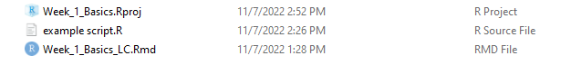
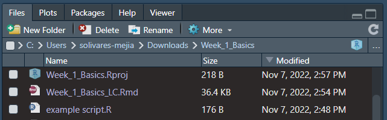

```{r setup, include=FALSE}
library(knitr) #load 'knitr package
opts_chunk$set(echo = TRUE)
```

# R101 - Week 1 {.tabset .tabset-pills}

## Introduction

#### Hello! Welcome to Laura and Sam's R101 teaching sessions! Today we're going to go over some of the R basics. Today's session is meant to be an introduction for those new to R, or a refresher for those who haven't coded in a while. 


### Outline for Today: 

####  1. Navigating RStudio
  
####  2. File Structures
  
####  3. Rmarkdown 
  
####  4. Installing Packages and Loading Libraries
  
####  5. Variables 
  
####  6. Data Structures
  
####  7. Base Operators and Functions

### Some things before we get started: 

#### R has a steep learning curve 
  - Like learning any other language (program or spoken) R can be tough to understand at first. That's ok! The foundation might be a bit frustrating, but it's this way for everyone. We'll take it slow at first, and always feel free to interrupt us for questions or clarifications. 
  
#### Mistakes are a part of the process 
  - Coding has very specific syntax (formatting) that needs to be followed for it to work, therefore typos and errors that 'break' the code will happen, and its ok for your code to not run perfectly on the first try. Like a puzzle, you might get stuck, but there are also many different ways to find a solution to a problem. 
  
#### There are lots of resources available 
  - R is an open source programming language, which means that its free for anyone to use and build upon. This also means there are A LOT of online resources to help you out along the way. 
  - There's a saying in the coding community that goes: "Good coders write good code; great coders steal great code." As long as you cite your sources and spend time understanding the code, don't spend more time than you have to writing code that already exists elsewhere. For example, this section of the R training is adapted from [Kate Miller's Intro to R IMD Training](https://github.com/KateMMiller/IMD_R_Training_Intro/blob/master/IMD_D1_M1_Intro_to_R_tab.Rmd). Check out the (Re)Sources tab for citations and more handy links! 
  - Google and Stack Overflow are your friends !! Many answers to common questions can be found by looking there. 
 
#### Why R?
You might be wondering, why bother to learn R at all?? 

  - R is one of the leading programming languages for statistics and data visualization, especially in the ecological community. 
  - R is great for data exploration and producing plots and tables ready for publication.
  - Because it's open source, people are adding onto R all the time, so it's continuously getting better.
  - As mentioned before, there are many resources available for beginner and more experienced users alike to be able to hone their skills.  
  
## Navigating RStudio
### How do I use RStudio? 
RStudio, is an interface that makes R more user-friendly. We will open the document you're reading now inside of RStudio. Before we do, let's take a look at the 4 main  windows or 'panes' we will work out of. 

**Source**: This is the panel where you will write/view your code. Some outputs like data sets may also appear as a tab here. 

**Console/Terminal**: The console will display the execution of the code in your source. You can write code in this section as well, however it is best practice to write your code in the source panel (in a Script or Rmd file) in order to save your progress. The terminal allows you to access your system shell. We will only be using the console today.

**Environment/History**: The environment will show what data sets and objects/variables you have created, as well as some properties of those objects such as their type and dimensions. The history tab contains a history of all the commands you've executed in R. 

**Files/Plots/Packages/Help/Viewer**: This panel will show you the contents of the directories on your computer. The tabs will help you navigate and set the working directory, show any plots generated, show what packages are actively loaded, and display help files for R functions and packages. 

```{r graphic1, echo=FALSE, fig.align="center", out.height="65%", out.width="65%"}
include_graphics("rstudio_session_4pane_layout.PNG")
```


## File Structures
### What kind of files does R use?
File structure is important when it comes to coding. Some file structures you can work out of in RStudio include **projects (.Rproj)**, **scripts (.R)** and **Rmarkdowns(.Rmd)**. A project is a collection of work organized in a folder. It allows you to keep all the files associated with a project together in one place, which makes it easier to import, export, and edit your files. To open or create a new project, navigate to 'File'>'Open Project' or 'New Project'. 

**TO DO**: In RStudio, go to 'File'>'Open Project'>'Week_1_Basics_LC.Rproj'. The project directory should pop up in the 'Files' panel of RStudio. 

Your project will typically include a mix of scripts and Rmarkdown files. Today your project also contains some PNG and HTML files. 

  - A script is a text file containing a set of commands and comments, it is the simplest version of a file that you can use in R. 
  - An Rmd file is a more stylized version of a script with formatted plain text and chunks of code that create a sophisticated output such as a PDF or HTML. 
  
Below is an example of how scripts, markdown files, and projects will look like in both your file explorer, and in RStudio. 

```{r graphic2, echo=FALSE, fig.align="center", out.height="65%", out.width="65%"}

```

```{r graphic3, echo=FALSE, fig.align="center", out.height="60%", out.width="60%"}

```

**TO DO**: Find and open the Week_1_Basics_LC.Rmd file using RStudio. It should open in the Source panel.  

You can work on scripts or Rmds independently instead of through a project, however if is best practice to create scripts/Rmd files within projects. 

*Note: You may have already noticed that we've been highlighting 'best practices'. This is because there are many ways to achieve the same goal in R, which makes it very easy to lose track of what you're doing and how you're doing it. In general best practices revolve around organization, documentation, and version control (saving your progress).* 

Throughout today's session we will have you run some of your own code in RStudio. Since the program's formatting is much different than what you may be used to, we recommend you use the document outline to navigate your way around.

To do so, click the button in the source pane of RStudio as seen in the image below. You can then click on each section header within the outline to jump to that part of the document.
```{r graphic4, echo=FALSE, fig.align="center", out.height="40%", out.width="40%"}

```


## Rmarkdown
### How does Rmarkdown work?
Let's dive into some of the aspects of an Rmd file. There are certain formatting elements to keep in mind when writing code in an Rmd. As mentioned before, an Rmd can include plain text (narratives) like what you're reading right now.

```{r}
# It can also contain chunks of code like this. 
```

Text within a code chunk needs a # in front of the line in order to be read as a comment instead of code to be executed. *It is best practice to comment along as you're coding so that you can keep track of what you're doing.* 

A code chunk usually starts with ```` ```{ }```` and ends with ```` ``` ```` on the last line. There are certain settings you can use to change what is shown in the Rmd output from the code chunk. For example, you can chose to only show the result of your code in the output and hide the code that executed that command. that's how I was able to insert the image in the previous section, without you seeing the code that did that.  

In addition to code chunks, you can also have 'inline' R code which is embedded in the narratives of the documents using the syntax `` `r ` ``. 

In the plain text, the formatting is slightly different. Instead of indicating the beginning of a comment, the # in the narrative creates a header. The number of # indicates how big the header is.
<br/><br/>

#### Here is an example header using four #s 
Do you notice how small the header is compared to the one at the top of this section? The more #s there are, the smaller the header.
<br/><br/>
We also just used `<br/><br/>` to add extra breaks between paragraphs. Like #s, the number of `<br/>` you use indicates the size, or number of  breaks between paragraphs. <p> We could also use `<p>` to start a new paragraph instead of starting a new line manually. 
<br/><br/>


### Text Formatting 
  - Text surrounded by ** on both ends ie. `**text**` creates **bold text**. 
  - Text surrounded by only one * on both ends ie. `*text*` creates *italicized text*. 
  - Additionally, a url surrounded by `< >` creates a hyperlink. You can even change the display text of the link by using the following format: `[text to display](link url)` There are other formatting nuances and further detail on the other elements we covered that can be found on this [Rmarkdown cheat sheet](https://www.rstudio.com/blog/the-r-markdown-cheat-sheet/)
  - To create bullet points, we used two spaces followed by a `-`

*Note: If you're reading this within RStudio, this section may be a bit confusing, because we've had to add additional syntax to display the examples properly in the output file. To get a clearer idea of these formatting details, read this document in its HTML format.* 
<br/><br/>

### Setting Parameters

In addition to text format, there are a couple other elements of an Rmarkdown to highlight. At the beginning of the document, you may have noticed a title, author and date. These were set using output options which are defined at the beginning of the Rmd file along with the output file type. You can also set the theme of the markdown as well as other parameters, but we won't go into detail on those today. 

```{r graphic6, echo=FALSE, fig.align="center"}
include_graphics("r_header.PNG") 
```

Let's take a closer look at `Sys.Date()` in the date parameter. This is an example of a function that executes a particular command. What does it do though? In order to look up help files for specific functions, go to the console in RStudio and enter `?Sys.Date()`. A help file will pop up in the 'Help' tab in the bottom right, which provides information on the function. Of note is the description, details, and examples. 

```{r graphic7, echo=FALSE, fig.align="center", out.height="70%", out.width="70%"}
 
```

**TO DO**: Go ahead and scroll to the top of the Rmd file in R studio and enter your name as the 'Learner'.

## Installing Packages and Loading Libraries

### How do I begin coding?
Now that we've learned about the basic format of our files, we have one more step before we can start executing commands. As we mentioned earlier R is open source, and there are many ways to achieve the same goal in R. Because of this, there are extensions to the programming language in the form of packages. Kind of like an expansion pack with new characters in a board game, packages are full of new functions that perform different tasks. 

### Necessary Functions

A function in R is a statement that takes a parameter(argument) and executes a command(performs a particular task). Some functions are included as part of the R programming language (known as Base R), while others have to be installed and loaded into our "library". You can even create your own functions! 

So how do we add packages to our library? There are two base functions we use to do this: `install.packages()` and `library()`. Notice how there is nothing inside the parentheses. Unlike `Sys.Date()`, we need to input an argument inside the function for it to work, in this case the name of the package we want to load in. 

There are several significant differences between the `install.packages()` and `library()` functions. The most important is that you only ever have to install a package once when using the same computer, but you will have to load the package into your library every time you open a new session in R. 

### Running the Code
**TO DO**: Let's check if you have 'knitr' installed already. In RStudio, Run the code chunk below by clicking the green 'play' button on the upper right hand corner of the code chunk. 

```{r}
#load 'knitr' package
library(knitr) 
```

If you got an error message, that means that you do not have 'knitr' installed already. Copy and paste `install.packages("knitr")` into the code chunk (above `library(knitr)`  and run it again to install the package. 

*Note: The order functions are written in matters! If you put `install.packages("knitr")` after`library(knitr)`, you will get an error message. This is because code runs top to bottom, and the knitr package would not have existed yet. The same goes for when you load packages into your library. You may have noticed that we already have `library(knitr)` at the beginning of the document. This is because the functions we used to insert the images into the Rmd earlier are from the knitr package.*

When you are done installing knitr, make sure to delete the line of code you copy and pasted into the code chunk. Since we will eventually turn this document into an HTML file, the `install.packages()`function needs to be removed in order to properly render the file. Now that you've installed 'knitr' you will never have to run `install.packages("knitr")` again!

### Checking our Work 
Now that we've loaded our packages and entered our name at the top of our document, let's see how our output has changed. 

**TO DO**:To render the document into an HTML, click the 'Knit' button at the top of the source pane. 
```{r graphic5, echo=FALSE, fig.align='center'}
include_graphics("knit.PNG")
```

After a moment the HTML document should replace the help file in the bottom right, this time in the Viewer tab. You should now see your name at the top of the document! 

## Variables

### What is an R variable?
A variable is a way to store a piece of information. It can later be used to reference or manipulate.


### How does it work?
The information is first named, then assigned a value. The value assignment can either be done directly by the user or programmatically assigned.

**TO DO** Below, write the most commonly used way of assigning a value in R.

How to assign a value:

*Hint: Python uses an =.*

*Hint: Example seen below.*


### Variable names
There are some rules to follow when assigning names. These include:

  - Easy to understand
  - No spaces or special characters
  - Starts with a letter
  - Letter is is followed by any letter, number, underscore, or period
  - No reserved words (reserved words are used in arguements and may cause computer confusion if used as a variable name)  Here is a list: https://rdrr.io/r/base/Reserved.html
  
**TO DO** Write a possible name for a variable which contains bird data

Bird data variable name:

*Hint: One example could be frequent_flyers*


### Variable practice
To start, we'll assign some simple variables for the different types of data that R uses.
<br/><br/>


#### 1. Numeric data
Variables can be assigned any number.

Here is an example:
```{r}
# R can hold whole numbers
Whole_Number <- 1
# R can hold multiple decimal places
Decimal <- 7.5895892
```
Run this code chunk (click the green arrow in the top right of the chunk).

Notice the environment (top right) now contains your variables and their assigned values.

  
**TO DO** Assign the variables in the code block below
```{r}
# Assign a negative number 
Negative_Number <- 9999
  
# Assign any other number
Any_Number <- 9999
```
*Tip: Notice that when a variable is properly assigned it changes color*


**TO DO** Assign a new number to the Decimal variable
```{r}
# Assign a new number
Decimal <-9999
```
Notice that the value has changed in your environment. 


**TO DO** What value would appear if we ran the first code (Decimal <- 7.5895892) again?

Answer:

*Hint: The value is always overwritten by the last code block, regardless of order in script.*
<br/><br/>


#### 2. Integers
Integers are a numeric value with no decimal points.

A suffix of L indicates that the value is an integer.Example below.
```{r}
# Assign an integer - example
Integer <- 1L
```


**TO DO** Assign your own integer
```{r}
# Assign an integer
My_Integer <- 9999
```
*Tip: Integers have a numeric color when properly assigned*
<br/><br/>


#### 3. Character data
Character data  can include words, sentences, filepaths, etc. It is stored and treated as a block of text.

Example:
```{r}
# Notice that single quotes are used to indicate the string component
Magical_Phrase <- 'Hello World'
```
Notice that the character data also occurs in your environment.

**TO DO** Lets try assigning some:
```{r}
# Assign a descriptive word
Adjective <- '9999'

# Assign your favorite animal
Animal <- '9999'

# Assign a celebrity name
Celebrity <- '9999'

# Assign anything!
Thing <- '9999'

# Assign a different thing
# Notice the 2 indicates that this is a different variable and the original Thing is not overwritten.
Thing2 <- '9999'
```

**TO DO** Can I use double quotes?
```{r}
#Assign a happy phrase in double quotation marks (")
Exclamation <- "9999"
```
*Hint: Yes! Single or double quotes may be used.*

**TO DO** Can I use more than one word?
```{r}
# Write the favorite activity you did last week
# Example: Activity <- "swam in the pool" 
#or
#Example: Activity <- "Ran on a trail"
Activity <- "9999"
```
*Hint: The quotation marks should be placed around the entire phrase*
<br/><br/>


#### 4. Complex
Complex data handles imaginary numbers in R

Imaginary numbers are indicated with an i.

**TO DO** Replace this imaginary animal with an imaginary number such as 2i.
```{r}
# Attribute Imaginary with a complex number. 
Imaginary <- 'Unicorn'
```
*Hint: Complex values do not require quotation marks, proper formatting will change the color to the numeric color*
<br/><br/>


#### 5. Logical/ Boolean
Logical data is True or False.

Example:
```{r}
# Assign as a TRUE logical value.
Logic_True <- TRUE
```
Notice that the TRUE value is all caps and the color is the same as the complex and numeric variables.

**TO DO** Create a false variable
```{r}
# Assign a false logical value
Logic_False <- 9999
```
*Tip: Autofill can be used. After typing "FAL" a dropdown will appear. Press down arrow and enter OR click to select*
<br/><br/>


#### 6. Raw
Converts other data types to raw bytes. This is not a common type.

Example:
chartoRaw() and intToBits() are used to convert a value to a raw variable type.
```{r}
# Character to raw example
Raw_Character <- charToRaw("Hello World")
# Integer to bits example
Raw_Int <- intToBits(7L)
```


## Data Structures

### What are data structures?
Data structures are storage components for holding multiple values.
<br/><br/>


#### 1. Vectors 
A vector is a collection of data values, such as characters, logical, integer, or numeric. It can be treated like a single column on a table.

Example. Here is a character vector. Use the notation c() (concatenate) to create the collection of values.
```{r}
# Create a character vector
Character_Vector <- c('Snoopy', 'Charlie Brown', 'Linus')
```
*Tip: Notice the environment show characters [1:3] (count of data) then lists the values*


**TO DO** Create an Atomic Vector, a vector that consists of one value, containing your favorite location. 
```{r}
# Assign a place
Place <- '9999'
```
*Hint: We made atomic vectors in the Variables section*


**TO DO** Create a numeric vector
```{r}
# Create a numeric vector
Number_Vector <- 9999
```
*Hint: separate values with commas and use the c() notation*


Vectors can use a combination of data types.
**To do**
Create a vector with 3 components of different data types.
```{r}
# Create a mixed vector
Mixed_Vector <- 9999
```
*Hint: Try a mix character, integer, numeric, or logical values*


Data structures, including vectors, can also reference previously created variables by using their names.
```{r}
# Create a mixed vector of different data types
My_Vector <- c(9999, 9999, 9999)
```
*Tip: Notice that this becomes a chr (character) list (shown in the environment). R will automatically determine an appropriate format unless otherwise specified by you*
<br/><br/>


#### 2. Lists
A list is a collection of data values, such as characters, logical, integer, or numeric. 
So why is this different than a vector?

Lists are ordered, recursive (loopable) and multidimensional!
(They are more complex so you can do more things!)


Here is an example of a simple list
```{r}
# Create a short list
List_Example<- list('test', 1, 2, 3)
```
Notice that the list appears in the data section of the environment.


Is it possible to create a list of other items?

**TO DO:** Create a list of your vector (My_Vector), List Example(List_Example), and one other atomic vector you previously created.
```{r}
# Create a list of lists
List_Of_Lists <- 9999
```
*Hint: Use the function list() to create a list*
<br/><br/>


#### 3. DataFrames
A data frame is a two dimensional way to store data, similar to a sheet in Microsoft Excel or Google sheets. We can also think of it as two or more vectors.

Example: Here is a simple dataframe created in R.
```{r}
# Create a vector for the first column
Song <- c("Rings", "Birds", "Hens", "Doves", "Partridge in a Pear Tree")
# Create a vector for the second column (same length)
Count <- c(5,4,3,2,1)

#Create the dataframe
Example_Dataframe <- data.frame(Song,Count)
```
*Tip: click on the data frame from the environment to open a new tab and view the sheet*
*Tip: press the down arrow in the environment to see a summary of data frame contents*


Please note. For most of SWNC work, we will be importing data frames (such as CSV files) rather than creating our own. This will be covered in another session.
<br/><br/>


#### 4. Matrices
A matrix is a set of rows and columns which organizes values of the same data type.

Mathmatical functions can be applied to matrices for complex analyses.
Here is an example matrix created in R:
```{r}
# The matrix creation requires the values (1-9), number of rows and/or number of columns)
Matrix_example <- matrix(c(1:9), nrow = 3, ncol = 3)
```
*Tip: Click on the matrix example in the environment to open a new tab and view all data*
<br/><br/>


#### 5. Arrays
Arrays are objects with two or more dimensions. Again, these are used for more complicated analyses in R. 

Example, a three dimensional array can be thought of as three stacked matrices, which will have a number of columns, rows and height.
```{r}
# Create an example array
Array_Example <- array(0, dim = c(2, 2, 3))
# Show the array named "Array_Example" below the code block
print(Array_Example)
```
*Tip: The array is considered a "value" in the environment of Rstudio. You can easily view the array (or any other object) by using the print() function to show it below a code block. We will go into more detail of the print() function later.*
<br/><br/>


#### 6. Factors
Factors are used to store categorical (grouped) data  in a way that can be used for calculations or other machine learning processes.

Factors can be ordinal (they have a rank or values are ordered) or non-ordinal.
Here is an example:
```{r}
# Create the categorical vector (any order is okay)
day_vector <- c('afternoon','night','morning')

# Convert `day_vector` to a factor with ordered level
# Order = TRUE indicates that it is ordinal
# levels indicates the order. It is only required if the order = TRUE
Factor_example <- factor(day_vector, order = TRUE, levels =c('morning', 'afternoon','night'))

#Print the Factor example below.
print(Factor_example)
```
**TO DO:** Fill in the blanks to create a non-ordinal factor with three values.
```{r}
# Create the vector
My_Vector <- c(9999)

#My_Factor <- factor(My_Vector, order = )
```

#### 7. Checking variable type
If you're unsure of the type of variable an object is, there are several functions to help you out. The simplest function is `typeof()` 

Example:
```{r}
#check data type and class type of Matrix_Example
typeof(List_Example)
```

There are also more specific functions that you can use to determine if a variable is a certain type. 

Example:
```{r}
#check data type and class type of Matrix_Example
is.numeric(Number_Vector)
is.numeric("blue")
is.matrix(Matrix_example)
is.character(5)
```
Notice how these functions return TRUE or FALSE.

## Base Operators and Functions

### How do I manipulate variables?
Base R has some operators we can use to manipulate variables. We've already been using **assignment operators** which are used to assign values to vectors (ie. `<-`, `=`)  

#### 1. Arithmetic Operators
Basic operators for arithmetic include +, -, *, and /, for addition, subtraction, multiplication, and division respectively. 

**TO DO**: Assign the following variable to the sum of the numeric values of your birth day and birth month
``` {r}
Number_A <- 9999
```
#### 2.	Relational Operators
We can also use operators to compare two values to one another, asking whether the values are less than (<), greater than(>), less than or equal to(<=), greater than or equal to(>=), equal to(==), or not equal to (!=) one another. When executed, the expressions return either a TRUE or FALSE.

**TO DO**: Replace the '-' with one of the operators to make the following statements TRUE
```{r, eval=FALSE}
#make these statements TRUE
105-66
27-84 
99-99
3-42
```
#### 3.	Basic Statistics Functions
R also has functions that can give you basic summary statistics (min, max, sum, mean, mode etc.) of a group of numbers. Let's use the Numeric_Vector your created earlier to show how you can find the sum of your values. 
```{r}
#Assign Number_B to the sum of the values in your vector
Number_B <- sum(Number_Vector)
```
**TO DO:** Find the min, max, and mode of your vector 
```{r}
#min
Number_C<- 9999
#max
Number_D<- 9999
#mode
Number_E<- 9999
```
*Hint: use the same format as you did to find the sum of your values*

There is also a function that lets us check if there is an `NA` in our data: `is.na()` 

Example: 
```{r}
#set variable to be NA 
na_example<- NA
#check if your data is an NA value 
is.na(na_example)
```
It might seem silly to have this function when we already know that na_example is an `NA`. However, when we have large sets of data, the function comes in handy. 

Example: 
```{r}
#create bad_data vector
bad_data<- c(3,4,NA,10,15,20,24,NA,40, 46)
#check what values are NA in bad_data
is.na(bad_data)
```
#### 4. Indexing 
In the previous section, we found out that the 3rd and 8th value of bad_data are `NA` values. We can confirm this using indexing `[]`

Example: 
```{r}
# use indexing to give us the 3rd value of bad_data
bad_data[3]
# use indexing to give us the 8th value of bad_data
bad_data[8]
# use indexing and c() to give us the 3rd and 8th value of bad_data 
bad_data[c(3,8)]
```
Indexing can be used for any data type, whether the data is a vector of characters or a matrix of numeric values. With a matrix, you will need to also specify the column since there are two dimensions instead of just one. We'll use `Character_Vector` and `Example_Dataframe` that we created earlier.
Example:
```{r}
#return the second value in Character_Vector
Character_Vector[2]
#return the value in the 4th row 1st column from Example_Dataframe 
Example_Dataframe[4,1]
```
To index a string, use we can use the `substr()` function. This requires you to specify at what character to start and stop at. Lets try it out with our `Magical_Phrase`; 'Hello World'

Example: 
```{r}
# Extract `Hello` from our Magical_Phrase 
first_word<-substr(Magical_Phrase,1,5)
#return first word
first_word
```
**TO DO**: Extract the verb from your `Activity` string using the `substr()` function
```{r}
# Extract your verb 
Verb<- 9999
```

Back to our bad_data, we can  use indexing to remove the NA values from our  now that we know what position they are in (3 and 8)

Example: 
```{r}
#remove the 3rd and 8th value from bad_data and assign as good_data
good_data<-bad_data[c(1,2,4,5,6,7,9,10)]
#return good_data
good_data
```
A less time consuming way would be to use our `is.na()` function and 'not' relational operator `!` to do that work for us. 

Example: 
```{r}
#assign good_data to bad_data that are not NA valuesusing is.na and ! operator
better_data <-bad_data[!is.na(bad_data)]
#return better_data
better_data 
```
Nice!! that was a taste of data wrangling which we'll cover more next time! 

#### 5.	Miscillaneous Operators 
The `:` operator creates a series of numbers in sequence for a vector. In our indexing example, we had to type out all the numbers except for 3 and 8. Using the `:` operator is another way to make this a lot easier for us. 

Example:
```{r}
#use the colon operator and indexing to remove NAs from bad_data
easier_data<-bad_data[c(1:2,4:7,9:10)]
#return easier_data
easier_data
```
For that example, it didn't make too much of a difference, but it can help a lot with large ranges of numbers. 

Example: 
```{r}
#create a large_data vector as all numbers from 1 to 100
large_data<- 1:100
#return large_data
large_data
```
The `%in%` operator lets us check if a value is within a set of values. For example, let's check if your `Number_Vector` from earlier contains the number 59.

**TO DO**: Run the code below 
```{r, eval=FALSE}
#check if 59 is in your Number_Vector
59 %in% Number_Vector
```
Most likely you got `FALSE` when you executed the code. If your Number_Vector had 59 in it the expression would have returned `TRUE`.

#### 5.	Logical Operators   
We can expand our previous statement by checking if 59 is in multiple vectors by using the AND (`&`) and OR (`|`) operators. As the names suggest, AND requires both conditions to be true, whilst OR requires at least one of the conditions to be true. 

**TO DO**: Run the code below 
```{r, eval=FALSE}
# check if 59 is in both vectors
(59 %in% Number_Vector & 59 %in% 55:60)
# check if 59 is in at least one of the vectors
(59 %in% Number_Vector | 59 %in% 55:60)
```
Even though the second vector contains 59, only the second statement is `TRUE` because the AND statement requires 59 to be in both the `Number_Vector` and `c(59,58,57)`.

#### 6. Conditional Statements 
Conditional statements allow you to take action based on a specific criteria, the most basic of which is an **if** statement. In this case, if the condition is met (the statement is TRUE), the code will run, otherwise it will not run. For this example we are going to add in a `print()` statement which returns a string of characters and requires the statement to be surrounded by quotation marks `""`. 

**TO DO**: Run the code below 
```{r, eval=FALSE}
# if 59 is in both vectors, print "yes, 59 is in both vectors"
if (59 %in% Number_Vector & 59 %in% 55:60){
  print("yes, 59 is in both vectors")
}
```

Unless your `Number_Vector` contains 59, nothing happened when you ran the code. Although this still tells us that 59 isn't in both vectors, it would be nice to have the code tell us why this is the case. An **if-else** statement expands on our original code; if the statement is `TRUE` the code will run, and if `FALSE` (else), a different chunk of code will run. Let's see how this works.

**TO DO**: Run the code below 
```{r, eval=FALSE}
# if 59 is in both vectors, print "yes, 59 is in both vectors", otherwise print "no, 59 is not in both vectors"
if (59 %in% Number_Vector & 59 %in% 55:60){
  print("yes, 59 is in both vectors")
} else{
  print ("no, 59 is not in both vectors")
}
```

There are several things to note about the syntax (format) of the if-else statement

  - the condition goes inside parentheses `()`
  - the code to execute goes inside curly brackets `{}`
  - the `else` statement goes on the same line as the closing curly bracket 
  
*Note: As a best practice, the curly brackets get their own line, this helps you keep track of whether or not you've 'closed' the expression. When you only have one expression, it doesn't make much of a difference, but if you have multiple nested conditions, the seemingly 'stylistic' choice comes in handy.*

#### 7. Test your knowledge:

**TO DO**: write an if-else statement to check if the sum of your `Number_Vector` is less than 12 or greater than 59. You can choose what to write for the print statement in both cases. 
```{r}
#write an if-else statement using the operators and functions you learned from this section
```
*Hint: Make sure to follow the same structure and use the operators outlined earlier. You'll need...*

  - *a conditional statement* 
  - *a basic statistics function*
  - *some relational operators*
  - *a logical operator* 
  - *some print statements*

## (Re)Sources 
### (Re)Sources
  - [Kate Miller's Intro to R IMD Training](https://github.com/KateMMiller/IMD_R_Training_Intro/blob/master/IMD_D1_M1_Intro_to_R_tab.Rmd)
  - [R Markdown Cookbook](https://bookdown.org/yihui/rmarkdown-cookbook/) Yihui Xie, Christophe Dervieux, Emily Riederer. 2022-09-09
  - [R Markdown:the Definitive Guide](https://bookdown.org/yihui/rmarkdown/) Yihui Xie, J.J. Allaire, Garret Grolemund. 2022-04-11 
  - [Rmarkdown cheat sheet](https://www.rstudio.com/blog/the-r-markdown-cheat-sheet/)
  - [Reserverd Words in R](https://rdrr.io/r/base/Reserved.html)


```{r, include = FALSE}


######################### End of Document. Stop here#########################################


```


```{r, include = FALSE}


##################### I mean it, stop scrolling, you'll ruin the surprise. #######################


```


## Extra
This section is meant to be blank and will make sense after the training session. 
<br> <br> <br> <br> <br> <br> <br> <br> <br> <br> <br> <br> <br> <br>
<br> <br> <br> <br> <br> <br> <br> <br> <br> <br> <br> <br> <br> <br>
<br> <br> <br> <br> <br> <br> <br> <br> <br> <br> <br> <br> <br> <br>
<br> <br> <br> <br> <br> <br> <br> <br> <br> <br> <br> <br> <br> <br>
<br> <br> <br> <br> <br> <br> <br> <br> <br> <br> <br> <br> <br> <br>
<br> <br> <br> <br> <br> <br> <br> <br> <br> <br> <br> <br> <br> <br>
<br> <br> <br> <br> <br> <br> <br> <br> <br> <br> <br> <br> <br> <br>
<br> <br> <br> <br> <br> <br> <br> <br> <br> <br> <br> <br> <br> <br>
<br> <br> <br> <br> <br> <br> <br> <br> <br> <br> <br> <br> <br> <br>
Why did you keep scrolling? 
<br> <br> <br> <br> <br> <br> <br> <br> <br> <br> <br> <br> <br> <br>
<br> <br> <br> <br> <br> <br> <br> <br> <br> <br> <br> <br> <br> <br>
<br> <br> <br> <br> <br> <br> <br> <br> <br> <br> <br> <br> <br> <br>
<br> <br> <br> <br> <br> <br> <br> <br> <br> <br> <br> <br> <br> <br>
<br> <br> <br> <br> <br> <br> <br> <br> <br> <br> <br> <br> <br> <br>
<br> <br> <br> <br> <br> <br> <br> <br> <br> <br> <br> <br> <br> <br>
Stop it!
<br> <br> <br> <br> <br> <br> <br> <br> <br> <br> <br> <br> <br> <br>
<br> <br> <br> <br> <br> <br> <br> <br> <br> <br> <br> <br> <br> <br>
<br> <br> <br> <br> <br> <br> <br> <br> <br> <br> <br> <br> <br> <br>
<br> <br> <br> <br> <br> <br> <br> <br> <br> <br> <br> <br> <br> <br>
<br> <br> <br> <br> <br> <br> <br> <br> <br> <br> <br> <br> <br> <br>
<br> <br> <br> <br> <br> <br> <br> <br> <br> <br> <br> <br> <br> <br>

You made it to the surprise! We put together a Mad Libs using the Variables YOU created during this training session. 

Presenting.... "The Best Halloween Party Ever"
```{r, echo=FALSE}
sprintf("Last night I went to the most %s Halloween party! The invitation was delivered by %s and it told me to go to the deep dark %s. I %s the doorbell %f times.My friend answered the door dressed up as %s and said '%s!' There were %f different costumes, including %f ghouls and %f mummified %ss. There were also delicious treats to eat like candy corn and %f candy bars, but my favourite part of the party was the pumpkin carving and bobbing for %ss. I can't wait until next Halloween!'", Adjective, Animal, Place, Verb, Number_A, Celebrity, Exclamation, Number_B, Number_C, Number_D,Thing, Number_E, Thing2)
```

Pretty cool huh? 


RStudio is neat in that it will store all the variables you've created throughout your session in your environment. However, this also means that you need to clear your environment whenever you open a new project in case the same variable names are used. This is why specific and clear naming conventions are important!

Even better, there's a function that will clear your environment for you: `rm(list=ls())`. Run it in your console after an R session and you're all set! 

If you forget to do this no worry, when you close the Rstudio window you'll get a pop up asking you if you'd like to save your work space. Just click "Don't Save" and you'll be good to go :)

# {-}